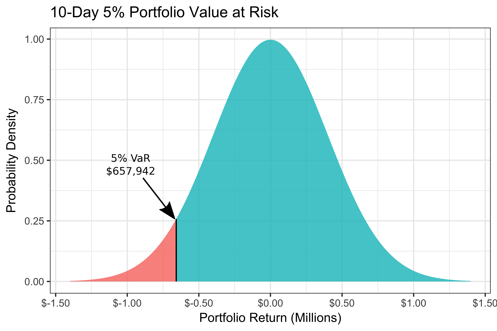

```{r setup, include = FALSE}
library(knitr)                              # paquete que trae funciones utiles para R Markdown
library(tidyverse)                          # paquete que trae varios paquetes comunes en el tidyverse
library(datos)                              # paquete que viene con datos populares traducidos al español :)
library(shiny)
library(icons)
# opciones predeterminadas
knitr::opts_chunk$set(echo = FALSE,         # FALSE: los bloques de código NO se muestran
                      dpi = 300,            # asegura gráficos de alta resolución
                      warning = FALSE,      # los mensajes de advertencia NO se muestran
                      error = FALSE)        # los mensajes de error NO se muestran


options(htmltools.dir.version = FALSE)


library(tidyverse)
library(lubridate)
library(readxl)
library(highcharter)
library(tidyquant)
library(timetk)
library(tibbletime)
library(quantmod)
library(PerformanceAnalytics)
library(scales)


library(tidyverse)
library(lubridate)
library(readxl)
library(highcharter)
library(tidyquant)
library(timetk)
library(tibbletime)
library(quantmod)
library(PerformanceAnalytics)
library(scales)

```


class: inverse, left, bottom
background-image: url("img/pitana3.jpg")
background-size: cover


# **`r rmarkdown::metadata$title`**
----

## **`r rmarkdown::metadata$institute`**

### `r rmarkdown::metadata$author`
### `r rmarkdown::metadata$date`

```{r xaringanExtra-share-again, echo=FALSE}
xaringanExtra::use_share_again()
```

```{r xaringanExtra-clipboard, echo=FALSE}
xaringanExtra::use_clipboard()
xaringanExtra::use_panelset()
```


---
name: hola
class: center, middle

.pull-left[
<br>
<br>


<br>

# <span style="font-size: 45px; color: #444444; font-weight: bold;"> Semillero de Investigación en Analítica e Ingeniería Financiera</span>

`r icon::fa("link", animate = "spin")` [www.semilleroanifunivalle.com](https://www.semilleroanifunivalle.com)


]

.pull-right[
<br><br>

]

---


class: center, middle


### [https://gifinc.univalle.edu.co/](https://gifinc.univalle.edu.co/)


---


<br><br>

.center[


[Orlando Joaqui-Barandica](https://www.joaquibarandica.com) <br/>
Universidad del Valle
]

<br>


.center[

*PhD. Ingeniería con enfásis en Ingeniería Industrial* 
 
*MSc. Economía Aplicada*
 
*Estadístico*

<br>

`r icon::fa("link", animate = "spin")` [www.joaquibarandica.com](https://www.joaquibarandica.com)

]


---
class: center, middle


# <span style="font-size: 50px; font-weight: bold;"> Acciones, decisiones y volatilidad</span>


## <span style="font-size: 28px; color: #444444;">En los mercados financieros, la incertidumbre no es una excepción. Es la regla.</span>

<br>

.pull-left[

> Situemos el contexto real de cualquier inversionista.


----

Cada día se toman millones de decisiones alrededor de activos financieros. Y esas decisiones no ocurren en ambientes de certeza. En los mercados financieros, la incertidumbre es la norma.

<br>

**¿Podemos cuantificar la incertidumbre?**
]


.pull-right[


]


---


# <span style="font-size: 48px; font-weight: bold;">Ejemplos de incertidumbre en los mercados financieros</span>

<br>

.pull-left[

- **Acciones tecnológicas:** <br> ¿Subirá o caerá el precio de una acción como NVIDIA tras una nueva regulación o lanzamiento?

- **Tasa de cambio USD/COP:** <br> Impactada por decisiones de la FED, precios del petróleo o eventos políticos internos.

- **Bonos soberanos:** <br> Cambios en el riesgo país pueden mover su valor en minutos.


]

.pull-right[
- **Criptomonedas:** <br> Alta volatilidad frente a noticias regulatorias o hackeos.

- **Commodities:** <br> El precio del café, el petróleo o el oro responde a guerras, clima y demanda global.

- **Tasas de interés de referencia:** <br> Pueden cambiar por inflación o política monetaria, afectando múltiples activos al mismo tiempo.

]

.center[
<br>
<span style="font-size: 26px; color: #444444;">La incertidumbre se manifiesta de muchas formas. Nuestro reto es medirla para tomar decisiones informadas.</span>
]

---


# <span style="font-size: 46px; font-weight: bold;">¿Cómo se ve la volatilidad?</span>

.pull-left[

### <span style="font-size: 26px; color: #444444;">Pensemos en acciones... Dos activos financieros pueden tener trayectorias similares, pero niveles de volatilidad muy distintos.</span>

<br>

> - La **volatilidad** mide qué tanto se desvían los precios respecto a su media.
> - A mayor volatilidad, mayor incertidumbre.
> - Visualizarla es el primer paso para aprender a cuantificarla.

]

.pull-right[

```{r volatilidad-series, echo=FALSE, fig.align='center', out.width='100%'}
set.seed(1234)
n <- 100
serie_baja <- 100 + cumsum(rnorm(n, 0, 5))
serie_alta <- 100 + cumsum(rnorm(n, 0, 15))

par(mfrow = c(1, 2))
plot(serie_baja, type = 'l', col = 'steelblue', lwd = 2,
     main = 'Serie con baja volatilidad', xlab = 'Tiempo', ylab = 'Valor')
plot(serie_alta, type = 'l', col = 'firebrick', lwd = 2,
     main = 'Serie con alta volatilidad', xlab = 'Tiempo', ylab = 'Valor')
par(mfrow = c(1, 1))
```

]


---


# <span style="font-size: 46px; font-weight: bold;">¿Y si lo vemos desde los retornos?</span>


```{r retornos-series, echo=FALSE, fig.align='center', fig.width=10, fig.height=4}
set.seed(1234)
n <- 100
serie_baja <- 100 + cumsum(rnorm(n, 0, 5))
serie_alta <- 100 + cumsum(rnorm(n, 0, 15))

ret_baja <- diff(serie_baja)
ret_alta <- diff(serie_alta)

par(mfrow = c(1, 2))
plot(ret_baja, type = 'l', col = 'steelblue', lwd = 2,
     main = 'Retornos: baja volatilidad', xlab = 'Tiempo', ylab = 'Retorno',ylim=c(-50,50))
plot(ret_alta, type = 'l', col = 'firebrick', lwd = 2,
     main = 'Retornos: alta volatilidad', xlab = 'Tiempo', ylab = 'Retorno',ylim=c(-50,50))
par(mfrow = c(1, 1))
```


----

.center[
### <span style="font-size: 26px; color: #444444;">El análisis de los precios puede ocultar detalles importantes.</span>
]


---


# <span style="font-size: 46px; font-weight: bold;">¿Y si lo vemos desde los retornos?</span>


.center[
### <span style="font-size: 26px; color: #444444;">Lo que realmente refleja la **volatilidad** es la variación diaria (los retornos).</span>

]


```{r retornos-series-hist, echo=FALSE, fig.align='center', fig.width=10, fig.height=4}
set.seed(1234)
n <- 100
serie_baja <- 100 + cumsum(rnorm(n, 0, 5))
serie_alta <- 100 + cumsum(rnorm(n, 0, 15))

ret_baja <- diff(serie_baja)
ret_alta <- diff(serie_alta)

par(mfrow = c(1, 2))
hist(ret_baja, breaks = 20, col = 'steelblue', lwd = 2,
     main = 'Retornos: baja volatilidad', xlab = 'Retorno', ylab = 'Frecuencia',xlim=c(-70,70))
hist(ret_alta, breaks = 20, col = 'firebrick', lwd = 2,
     main = 'Retornos: alta volatilidad', xlab = 'Retorno', ylab = 'Frecuencia',xlim=c(-70,70))
par(mfrow = c(1, 1))
```


---

# <span style="font-size: 46px; font-weight: bold;">Entonces, ¿Qué factores mueven el valor de una acción?</span>


### <span style="font-size: 28px; color: #444444;">La respuesta no es sencilla: expectativas, tasas, política monetaria, confianza, flujos internacionales...</span>


.center[
### <span style="font-size: 26px; color: #006D5B;">Pero detrás de cada cambio hay datos. Y detrás de los datos, decisiones.</span>
]


.pull-left[

Una acción no solo depende del estado financiero de una empresa. Su valor refleja lo que el mercado espera que ocurra. Por eso, factores como las tasas de interés, el contexto económico global o incluso un tweet pueden generar cambios drásticos. 


> Nuestro trabajo es identificar y entender esas variables que están detrás de cada movimiento.

]

.pull-right[

.center[

]
]


---
class: inverse, center, middle
background-image: url("img/nvidia.png")
background-size: cover

# <span style="font-size: 54px; font-weight: bold; color: #ffffff; text-shadow: 2px 2px 10px #000000;">La volatilidad entonces nos hace ganar... y también nos hace perder</span>

---

# <span style="font-size: 46px; font-weight: bold;">¿Cómo cuantificamos la posibilidad de perder?</span>


### <span style="font-size: 30px; color: #444444;"> >>>>> La estadística y la analítica financiera nos ofrecen herramientas para medir el riesgo.</span>

### <span style="font-size: 28px; color: #006D5B;">Una de ellas: el <strong>Value at Risk (VaR)</strong>, clave para decisiones informadas sobre portafolios e inversiones.</span>


----
<br>

.pull-left[
<br>
## Toda inversión conlleva una posibilidad de pérdida.
]

.pull-right[

#### Pero... ¿cómo cuantificamos esa posibilidad de forma objetiva?

#### ¿Podemos medir cuánto se puede perder y con qué probabilidad? 

>Herramientas como el VaR nos permiten hacerlo de manera técnica y basada en datos.
]

<br>
----


---
class: inverse, center, middle
background-image: url("img/Lobo.jpg")
background-size: cover

# <span style="font-size: 55px; font-weight: bold; color: #ffffff; text-shadow: 2px 2px 10px #000000;">Bienvenido al mundo de las Finanzas</span>

## <span style="font-size: 40px; color: #FFFFFF;">Donde el valor de una decisión se mide en millones... <br> y el riesgo se convierte en tu mejor aliado si sabes cómo entenderlo.</span>

---
class: center, middle

# <span style="font-size: 48px; color: #444444;">¿Qué tienen en común Netflix, Ecopetrol y Tesla?</span>

### <span style="font-size: 32px; color: #444444;">Son acciones que suben, bajan, emocionan y preocupan...</span>

<br>

### <span style="font-size: 28px; color: #006D5B;">Y para tomar decisiones inteligentes sobre ellas...</span>

## <span style="font-size: 38px; color: #ffa500; font-weight: bold;">¡Necesitas Analítica Financiera y Medición del Riesgo!</span>

---


# <span style="font-size: 46px; font-weight: bold;">¿Qué es una acción?</span>


<br><br>

.pull-left[

> - Una acción representa una fracción de propiedad de una empresa. 

> - Comprar una acción te convierte en socio o accionista.

> - Te da derecho a recibir parte de las utilidades (como dividendos) y, en algunos casos, a participar en las decisiones corporativas.

]

.pull-right[

> - Los derechos dependen del tipo de acción: comunes o preferenciales.

> - Además de los dividendos, puedes obtener ganancias de capital si vendes a un precio más alto que el de compra.

]

<br>


----


### <span style="font-size: 30px; color: #444444;"> >>>>> Las acciones pueden ser comunes o preferenciales.</span>


---

# <span style="font-size: 46px; font-weight: bold;">Tipos de acciones</span>


.pull-left[

## Acciones comunes:
- Representan la propiedad básica de la empresa.
- Derecho a voto en asambleas de accionistas.
- Dividendos variables: dependen de las ganancias y decisión de la junta.
- Mayor riesgo, pero con mayor posibilidad de crecimiento a largo plazo.

**Ejemplo:** Si compras acciones comunes de Ecopetrol, puedes recibir dividendos cuando haya utilidades y participar en decisiones si tienes suficiente porcentaje.

]

.pull-right[

## Acciones preferenciales:
- Prioridad en el pago de dividendos.
- No suelen tener derecho a voto.
- Dividendos más estables o fijos.
- Menor riesgo, pero con menos posibilidad de valorización.

**Ejemplo:** Una acción preferencial en una empresa puede garantizarte el 5% anual, sin importar si otros accionistas comunes reciben más o menos.

]


---


# <span style="font-size: 46px; font-weight: bold;">¿Y si compras acciones de Netflix?</span>

.pull-left[

> - Te conviertes en **accionista de Netflix Inc.**  

> - Si compras una acción a 400 USD, y luego sube a 500 USD, puedes vender y ganar la diferencia (**ganancia de capital**).

> - Si Netflix paga dividendos (no siempre lo hace), podrías recibir un pago periódico.

> - Como es una acción común, **no tienes garantizado un retorno fijo**, pero sí participas en el valor de mercado de la empresa.

> - Tus derechos son limitados si tienes pocas acciones (sin poder de voto real).

]

.pull-right[

<br><br>
.center[

]
]

---

class: middle

.pull-left[

# <span style="font-size: 46px; font-weight: bold;">¿Cómo se valoriza una acción?</span>


<span style="font-size: 30px; color: #444444;"> >>>>> Oferta y demanda:</span> si muchas personas quieren comprar, el precio sube.


<br>

<span style="font-size: 30px; color: #444444;"> >>>>> Indicadores fundamentales:</span> utilidad por acción, dividendos, crecimiento, etc.

<br>

<span style="font-size: 30px; color: #444444;"> >>>>> Factores externos:</span> ssituación económica, tasas de interés, noticias.

]


.pull-right[

# <span style="font-size: 46px; font-weight: bold;">¿Qué son los dividendos?</span>


- **Distribución de ganancias:** es la parte de las utilidades que una empresa reparte entre sus accionistas.
- **Formas de pago:** pueden entregarse en efectivo o en forma de nuevas acciones.
- **No todas las empresas los otorgan:** algunas reinvierten todo para crecer (como muchas tecnológicas).
- **Ajuste en el precio:** cuando se reparten, el precio de la acción suele bajar por el valor del dividendo entregado.


]

---

# <span style="font-size: 46px; font-weight: bold;">¿Qué es el riesgo en finanzas?</span>


<span style="font-size: 30px; color: #444444;"> >>>>> Posibilidad de que el resultado de una inversión sea diferente al esperado.</span>


.pull-left[

## Tipos de riesgo:
- **Riesgo de mercado:** variaciones en precios o tasas.  
  *Ejemplo:* una subida en las tasas de interés hace caer el valor de los bonos que posees.

- **Riesgo específico:** relacionado a la empresa o sector.  
  *Ejemplo:* un escándalo contable en una empresa hace caer su acción, aunque el mercado general esté estable.

- **Riesgo sistémico:** afecta a todo el sistema financiero.  
  *Ejemplo:* una crisis financiera global que desploma las bolsas del mundo.

]


.pull-right[

.center[
```{r, echo=FALSE, fig.align='center', out.width='50%'}

```
]

]

---


# <span style="font-size: 46px; font-weight: bold;">Qué es una cartera de inversión?</span>


Una cartera de inversión es el conjunto de activos financieros que pertenecen a una persona o por una institución, ya sea una sociedad o un fondo.


.pull-left[

```{r , fig.align='center', out.width="300px"}


```


 ]

.pull-right[

> Qué puede contener una cartera?

- Acciones
- Obligaciones
- Materias primas
- Fondos
- Pólizas
- Etc.

]

---


# <span style="font-size: 46px; font-weight: bold;">Asignación de activos y riesgo</span>


#### La cartera refleja la propensión al riesgo del inversor, así como el horizonte temporal y los objetivos de su inversión.


.center[

## Rentabilidad vs Riesgo


]


.center[
`Diversificar correctamente la inversión permitirá que la cartera esté expuesta a menos riesgos que si se invierte en una única clase de activos o en un único título.`
]


---


background-image: url("https://media.giphy.com/media/m65GQLUX8faUw/giphy.gif")
background-size: cover
class: inverse, center, middle

# <span style="font-size: 46px; font-weight: bold;">Rentabilidad vs Riesgo</span>


---


# <span style="font-size: 46px; font-weight: bold;">¿Por qué crear una cartera de inversión?</span>


.pull-left[

.center[

## La creación de una cartera de inversión obedece a la necesidad del inversor de diversificar sus inversiones

## con el fin de..

## reducir sus riesgos de pérdida.

]

]


.pull-right[

<br>
<br>

.center[

]
]


---


# <span style="font-size: 46px; font-weight: bold;">¿Quién gestiona la cartera de inversión?</span>


.center[

]


.center[
### La cartera pertenece al inversor  pero puede ser gestionada por un profesional financiero, por un banco, por un fondo o por otras instituciones financieras.
]

---

# <span style="font-size: 46px; font-weight: bold;">Diversificar y cubrir riesgos</span>


.pull-left[

<br>

La principal premisa de cualquier portafolio de inversión, especialmente a largo plazo, es alcanzar el equilibrio.

----
>Independientemente del **perfil inversor de cada persona**, una buena cartera debe de ser capaz de cubrir los riesgos de los activos `más agresivos` con otros más `conservadores.`

----

<br>

.center[
### Diversificar la inversión es la mejor fórmula para lograrlo.
]

]


.pull-right[


.center[

```{r , fig.align='center', out.width="600px"}


```


<br>


Del mismo modo que en bolsa no es recomendable tener acciones sólo de una empresa o de un sector en concreto, tampoco hay que fiar todo el patrimonio a un tipo de inversión o familia de productos
]


]


---

background-image: url("https://media.giphy.com/media/5UEO7c7Ubk5pKQYwje/giphy.gif")
background-size: cover
class: inverse, center, middle

# <span style="font-size: 46px; font-weight: bold;">¿Cuánto invertir en cada activo?</span>


---

class: left, bottom
background-image: url("img/back1.png")
background-size: cover


---

class: left, bottom
background-image: url("img/back2.png")
background-size: cover


---

class: left, bottom
background-image: url("img/back3.png")
background-size: cover


---

class: left, bottom
background-image: url("img/back4.png")
background-size: cover


---

class: left, bottom
background-image: url("img/back5.png")
background-size: cover


---

class: left, bottom
background-image: url("img/back6.png")
background-size: cover


---

class: left, bottom
background-image: url("img/back7.png")
background-size: cover


---

class: left, bottom
background-image: url("img/back8.png")
background-size: cover


---

class: left, bottom
background-image: url("img/back9.png")
background-size: cover


---

class: left, bottom
background-image: url("img/back10.png")
background-size: cover


---

class: left, bottom
background-image: url("img/back11.png")
background-size: cover


---


background-image: url("https://media.giphy.com/media/3o7abIileRivlGr8Nq/giphy.gif")
background-size: cover
class: inverse, center, middle

# <span style="font-size: 46px; font-weight: bold;">Hoy ganamos!!... mañana?</span>


---


class: center, middle

# <span style="font-size: 46px; font-weight: bold;">Ahora que conocemos múltiples conceptos,<br> miremos como medir el riesgo</span>


---


# <span style="font-size: 46px; font-weight: bold;">Valor en Riesgo (VaR)</span>


.pull-left[

<br>
<br>

El Valor en Riesgo (VaR) es una de las medidas utilizadas para evaluar el riesgo de una determinada posición o cartera de activos financieros.

<br>

La definición del VaR puede hacerse en términos de **rentabilidades** o en términos de **Pérdidas y Ganancias** (términos nominales).

]


.pull-right[


]


---


class: center, middle


# El VaR responde entonces a la pregunta:


### ¿Cuál es la caída o pérdida que se podría sufrir en condiciones normales de mercado en un intervalo de tiempo y con cierto nivel de probabilidad o de confianza?


---


class: center, middle

## Es decir, indica la probabilidad (normalmente 1% o 5%) de sufrir una determinada pérdida durante un periodo de tiempo (normalmente 1 día, 1 semana o 1 mes).

--

<br>

## Una interpretación equivalente es:

--

<br>

### Con probabilidad $$1- \alpha$$ el propietario de dicha posición experimentará una pérdida no superior al VaR.

---

# <span style="font-size: 46px; font-weight: bold;">Valor en Riesgo (VaR)</span>

.pull-left[

Ejemplo:

<br>

> Inviertes en acciones de **Netflix** por un valor total de **10 millones de pesos**.  
> Luego de aplicar un modelo, encuentras que el **VaR diario al 95%** es de **350 mil pesos**.

<br>

----

<br>


]

.pull-right[


]

> Esto quiere decir que, si las condiciones del mercado se comportan como se espera, es muy poco probable (solo un 5%) que pierdas más de 350 mil pesos en un solo día.

> `O dicho de otro modo: con un 95% de confianza, la pérdida diaria no pasará ese valor.`

---

# <span style="font-size: 46px; font-weight: bold;">Valor en Riesgo (VaR)</span>


```{r Var1, echo=FALSE, fig.align="center", out.width="50%"}

```

.center[

### Por consiguiente, el VaR no es sino un determinado percentil de la distribución de probabilidad prevista para las variaciones en el valor de mercado de la cartera en el horizonte de tiempo escogido.

]

---

# <span style="font-size: 46px; font-weight: bold;">Valor en Riesgo (VaR)</span>


## Tipos de VaR


- **VaR Histórico, No Paramétrico:** se encuentra el $\alpha$ percentil de la distribución histórica de los datos.

<br/>

- **VaR Paramétrico:** se calcula el VaR con base en un modelo que describe su función de densidad de las pérdidas. La cual debe ser estimada.
  - VaR suponiendo que las pérdidas siguen una distribución Gaussiana no condicional.

  - VaR modelando los valores futuros de la media y la varianza condicionales.

  - VaR por simulación de Montecarlo (estimando la función multivariada que describe los datos, por ejemplo mediante cópulas)


---


# <span style="font-size: 46px; font-weight: bold;">Valor en Riesgo (VaR)</span>


## Tipos de VaR: Método No Paramétrico - Histórico


.pull-left[

- No precisa hacer supuestos acerca de la forma paramétrica de la distribución de rentabilidades de los factores de riesgo o de la cartera.


- El método histórico debe utilizarse solo para el cálculo del VaR a un horizonte de muy pocos días.


]


.pull-right[

$$VaR_{(1-\alpha)} = q_{(1-\alpha)(R)}  \nonumber$$

]


---


# <span style="font-size: 46px; font-weight: bold;">Cálculo del VaR (VaR)</span>


## Tipos de VaR: Método Paramétrico - Distribución Gaussiana


.pull-left[

- Suponemos que la distribución de las rentabilidades de los factores sigue una distribución Normal multivariante y la cartera es función lineal de los factores.

- Su ventaja es que es tratable analíticamente, pero solo se puede generalizar a una pocas formas paramétricas, como la Normal, la t-Student, o mixturas de Normales o de t-Student.


]


.pull-right[


.center[
Como $\alpha$ es un valor reducido: 5%, 1% o 0.01%, entonces $R^*$ será una rentabilidad negativa, y el VaR se proporciona cambiando el signo.
]


$$VaR = -R^{\*} \Rightarrow \alpha = P(R<R^{\*}) = \Phi\left( \frac{R^{\*}-\mu_R}{\sigma_R} \right) \nonumber$$

$$VaR_{(1-\alpha)} = \Phi^{-1}(1-\alpha) \sigma_R - \mu_R  \nonumber$$


]

---


# <span style="font-size: 46px; font-weight: bold;">Cálculo del VaR (VaR)</span>


## Tipos de VaR: Método de normalidad estático


$$VaR_{(1-\alpha)} = \Phi^{-1}(1-\alpha) \sigma_R - \mu_R  \nonumber$$


## Tipos de VaR: Método de normalidad condicional


$$VaR_{(1-\alpha),t+1} = \Phi^{-1}(1-\alpha) \sigma_{R,t+1} - \mu_{R,t+1}  \nonumber$$


- Estimación de $\mu_{t+1}$: Modelos ARIMA de series de tiempo
- Estimación de $\sigma_{t+1}$: Modelos de varianza condicional:
  - Modelos GARCH: como un ARMA sobre la varianza con algunas restricciones.
  - Modelos de Volatilidad Estocástica: una versión más general de los GARCH.


---


# <span style="font-size: 46px; font-weight: bold;">Cálculo del VaR (VaR)</span>


## Tipos de VaR: Método de simulación MonteCarlo - estático


$$VaR_{(1-\alpha)} = \sigma_R(-q_{(1-\alpha)}(Z))  - \mu_R, \quad \quad Z\sim N(0,1)  \nonumber$$


## Tipos de VaR: Método de simulación MonteCarlo - dinámico


$$VaR_{(1-\alpha)} = \sigma_{R,t+1}(-q_{(1-\alpha)}(Z))  - \mu_{R,t+1}, \quad \quad Z\sim N(0,1)  \nonumber$$

---

# <span style="font-size: 46px; font-weight: bold;">Limitaciones del VaR</span>


.pull-left[


----

> - **No dice qué tan grande puede ser la pérdida si se supera el VaR.** Solo indica un umbral, pero no cuantifica lo peor que podría pasar.

> - **Puede inducir falsas sensaciones de seguridad:** al centrarse solo en el percentil, ignora las pérdidas extremas más allá de ese umbral.

> - **Puede incentivar malas decisiones:** Como el VaR no muestra qué tan graves pueden ser las pérdidas más allá del umbral, algunos inversionistas podrían tomar riesgos excesivos, confiando en que el VaR "no se ve tan alto". Esto puede ocultar peligros reales en eventos extremos.


----

]

.pull-right[

Aunque existen varios métodos para calcular el Valor en Riesgo (VaR), todos comparten ciertas limitaciones que no se pueden ignorar.


.center[

]


]


---

# <span style="font-size: 46px; font-weight: bold;">Expected Shortfall (CVaR)</span>


.pull-left[


El VaR te dice cuál es la pérdida máxima esperada en condiciones normales, con un nivel de confianza dado (por ejemplo, el 95%).
Pero no te dice nada sobre qué pasa si esa pérdida se supera.

Ahí entra el `Expected Shortfall (CVaR):`

- Estima el promedio de las pérdidas más graves, es decir, aquellas que superan el VaR.

- Nos da una idea de qué tan mal pueden ponerse las cosas si ocurre un evento extremo.


> **Si el VaR es un “límite de seguridad”, el CVaR te dice qué tan profundo es el abismo si lo cruzas.**

]

.pull-right[


```{r Var2, echo=FALSE, fig.align="center", out.width="90%"}

```


----


$$ES = E[R / ( R < VaR )] \nonumber$$

----


]


---


# <span style="font-size: 46px; font-weight: bold;">¿Qué es el horizonte temporal en el VaR?</span>


- Es el **periodo de tiempo sobre el cual se mide el riesgo**.
- Ejemplos comunes: 1 día, 10 días, 1 mes.
- A mayor horizonte, mayor incertidumbre → mayor VaR.

### Ejemplo práctico con Netflix

- Supongamos que tienes **retornos diarios** de Netflix por 1 año.
- Si calculas el **VaR histórico** usando esa serie:

### - El horizonte es **1 día**.

¿Por qué?
> Porque cada punto de tu muestra representa la pérdida o ganancia en un solo día. Por tanto, el percentil refleja el riesgo de **una jornada**.

---


# <span style="font-size: 46px; font-weight: bold;">Código en R</span>


.scroll-output[

```{r eval =FALSE, echo=TRUE, message=FALSE, warning=FALSE , fig.height = 6 }
library(quantmod)
library(PerformanceAnalytics)
library(yahoofinancer)


#########Fecha inicial de descarga de datos
maxDate = "2005-01-01"

#Serie a descargar
tick<-"NFLX"

#Obtener la serie de precios desde Yahoo Finance

# La siguiente linea funciona con la libreria de quantmod
# Actualmente está presentado problemas
#prices <- Ad(getSymbols(tick, src="yahoo", auto.assign = FALSE, from=maxDate))
#plot(prices)
#View(prices)


# Actualmente se puede utilizar esta otra librería
# library(yahoofinancer)


accion <- Ticker$new(tick)

# Cargo los datos desde la API
prices<- accion$get_history(start = maxDate, interval = '1d')


View(prices)


# Esta libreria me permite convertir la data a serie de tiempo
library(xts)

# Tomar la columna 'close' y convertirla a xts
close_prices <- xts(prices$close, order.by = as.Date(prices$date))


# Grafico
plot(close_prices, main="Precio de cierre NFLX")

chartSeries(close_prices)

chartSeries(close_prices, theme = chartTheme("white"), 
            name = "Precio de cierre NFLX", type = "line")


#Calcular retornos
rets <- dailyReturn(close_prices)
plot(rets)
hist(rets)
hist(rets,breaks = 60)

# Un gafico más estilizado
# utilizando library(PerformanceAnalytics)
chart.Histogram(rets, 
                main = "Distribución de retornos diarios - NFLX", 
                col = "darkred", 
                methods = c("add.normal", "add.rug"))


library(tseries)
jarque.bera.test(rets)

# Rechazo la hipotesis de normalidad si pvalue < 0.05
# los retornos no son normales


#Calcular VaR y CVaR
VaR(rets,p=0.95,method = "historical")
quantile(rets,0.05)


paste0("Con un 95% de confianza, la pérdida diaria no superará el ", 
      round(-quantile(rets,0.05)*100,2),
      "% del valor invertido, bajo condiciones de mercado similares a las históricas.")


# Si realizo una inversión de $20.000.000 COP 
Inversion = 20000000

as.numeric(-quantile(rets,0.05)* Inversion)


paste0("En condiciones normales de mercado, hay un 95% de probabilidad de no perder más de $",
       round(as.numeric(-quantile(rets,0.05)* Inversion)),
       " pesos en un solo día.",
       " Pero también implica que hay un 5% de probabilidad de que la pérdida sea mayor.")


#Miremos el VaR Condicional
ES(rets,p=0.95,method = "historical")


paste0("Si ocurre un evento extremo más allá del VaR, la pérdida promedio sería de $",
       round(as.numeric(-ES(rets, p = 0.95, method = "historical")) * Inversion),
       " pesos. Es decir, si se presenta uno de esos días muy malos, se espera perder en promedio un ",
       round(-ES(rets, p = 0.95, method = "historical") * 100, 2),
       "% del valor invertido.")


# Aunque el test de Jarque-Bera nos dijo que los retornos no 
# son normales, aplicamos de todos modos el método paramétrico 
# (gaussiano) para ver qué tan distinta es la estimación 
# frente al método histórico.

VaR(rets,p=0.95,method = "gaussian")
ES(rets,p=0.95,method = "gaussian")


# El VaR Gaussiano fue más pesimista que el histórico, 
# lo cual no siempre ocurre.
# El ES Gaussiano fue menor que el histórico, 
# lo cual puede ser peligroso, porque subestima el riesgo extremo 
# si los retornos reales tienen colas pesadas.
# Este ejercicio sirve para enseñar que asumir normalidad 
# puede llevar a errores si no se verifica la 
# distribución real de los datos.


#####################################################################
#####################################################################
#####################################################################
# PORTAFOLIO


#Opción libreria quantmod

#Series que conforman el portafolio
#tickers<- c("MSFT", "AAPL", "AMZN")
#Obtener series de precios del portafolio
#getSymbols(tickers, from=maxDate)
#View(AAPL)


#Opción libreria yahoofinancer

library(yahoofinancer)
library(xts)
library(PerformanceAnalytics)

tickers <- c("MSFT", "AAPL", "AMZN")
maxDate <- "2010-01-01"

#Definir pesos del portafolio
weights<-c(0.5,0.1,0.4)


# Descargar precios con yahoofinancer
precios_lista <- lapply(tickers, function(tick) {
  ticker <- Ticker$new(tick)
  data <- ticker$get_history(start = maxDate, interval = "1d")
  xts(data$close, order.by = as.Date(data$date))
})


# Unir las series en un solo xts
names(precios_lista) <- tickers
Port.prices <- do.call(merge, precios_lista)
colnames(Port.prices) <- tickers


# Visualizar series
plot(Port.prices, main = "Precios de cierre - Portafolio")

library(dygraphs)
dygraph(Port.prices, main = "Precios de cierre - Portafolio") %>%
  dyOptions(colors = c("steelblue", "darkgreen", "firebrick")) %>%
  dyLegend(show = "always", width = 300)


library(tidyverse)

# Convertir xts a data.frame
df_prices <- fortify.zoo(Port.prices, name = "Fecha") %>% 
  pivot_longer(-Fecha, names_to = "Ticker", values_to = "Precio")

ggplot(df_prices, aes(x = Fecha, y = Precio, color = Ticker)) +
  geom_line(size = 1) +
  labs(title = "Precios de cierre - Portafolio", x = "Fecha", y = "Precio") +
  theme_minimal() +
  scale_color_manual(values = c("steelblue", "darkgreen", "firebrick"))


#Retornos del portafolio
Port.returns <- ROC(Port.prices,type="discrete")[-1]
colnames(Port.returns)<-tickers
View(Port.returns)
plot(Port.returns)

VaR(Port.returns,
    p = 0.95,                     # Nivel de confianza del 95%
    weights = weights,           # Pesos del portafolio: importancia de cada activo
    portfolio_method = "component", # Método de portafolio:
    # "component" calcula la contribución de cada activo al riesgo total
    method = "historical")          # Método de estimación: basado en los datos históricos de retornos

# Resultados:
# $hVaR: Valor en Riesgo total del portafolio → 0.0255 = 2.55%
#       Con un 95% de confianza, la pérdida diaria no superaría el 2.55% del valor total invertido.

# $contribution: contribución marginal de cada activo al VaR (en valor absoluto)
# $pct_contrib_hVaR: porcentaje que aporta cada activo al VaR total
# → AMZN aporta el 66%, MSFT el 24.7% y AAPL el 9%. AMZN es el que más riesgo aporta al portafolio.

# ----------------------------------------------------------

# Calcular el Expected Shortfall (ES) o Conditional VaR del portafolio

ES(Port.returns,
   p = 0.95,                      # Nivel de confianza del 95%
   weights = weights,            # Pesos del portafolio
   portfolio_method = "component", # Método: queremos descomponer por contribución
   method = "historical")          # Método: basado en la historia real de retornos

# Resultados:
# $-r_exceed/c_exceed: ES total del portafolio → 0.0373 = 3.73%
#       En los peores días (peor 5% de retornos), se espera perder en promedio 3.73% del portafolio.

# $pct_contrib_hES: contribución porcentual de cada activo al ES total
# → AMZN y MSFT tienen contribuciones similares (~46%), mientras que AAPL solo el 8%.
# Esto sugiere que AAPL tiene menor exposición en eventos extremos.


VaR_modificado <- VaR(Port.returns,
                      p = 0.95,
                      weights = weights,                    # pesos del portafolio
                      portfolio_method = "component",       # descomposición por contribución
                      method = "modified")                  # Cornish-Fisher

VaR_modificado


ES_modificado <- ES(Port.returns,
                    p = 0.95,
                    weights = weights,
                    portfolio_method = "component",
                    method = "modified")

ES_modificado


# Método "modified" usa la aproximación de Cornish-Fisher,
# que ajusta el cálculo del VaR/ES según la asimetría y curtosis de los retornos.
# Es útil cuando los retornos no son normales.

############################################################################


#Simulación Monte Carlo para el VaR de una acción


#Instalar librerias

library(quantmod)
library(xts)
library(tidyverse)
library(dplyr)


#Simulamos un año bursatil

periodos <- 252
periodos <- periodos - 1


AMZN <- Port.prices$AMZN

AMZN_log_returns <- dailyReturn(AMZN, type="log")

# Creamos la función

gbm_sim <- function(periodos, close_prices, vector_returns) {
  # estimadores de mu y sigma
  mu <- mean(vector_returns)
  sig <- sd(vector_returns)
  fin <- length(vector_returns)
  ini <- fin - periodos
  
  # simulacion
  sim_actual_values <- AMZN[ini]
  S <-  vector(mode="numeric", length=periodos) # aqui vamos guardando los valores
  S[1] <- sim_actual_values
  for (t in c(2:periodos) ) {
    new_S <- S[t-1] * exp( (mu-(0.5*sig^2)) + sig * rnorm(1)   )
    S[t] <- new_S
  } 
  return(S)
}

#Ahora simulamos 1000 realidades distintas

# AHora podemos simular varias veces y plotear:
n_sims = 1000
n_periods = 252
sims <- matrix(NA, ncol=n_sims+1, nrow=n_periods)

for (i in 1:n_sims) {
  values <-  gbm_sim(periodos = 252, close_prices =  AMZN, vector_returns = AMZN_log_returns)
  sims[, i] <- values
}
sims[, n_sims+1] <- 1:n_periods

# Seteo del plot
plot(sims[, n_sims+1], sims[,1], type="l",
     xlab="tiempo", ylab="W(t)", ylim=c(0, 800))
colors = rainbow(n_sims)

# add lines
for ( i in 1:n_sims) {
  lines(sims[, n_sims+1], sims[,i], type="l", col=colors[i])
}


# VALUE AT RISK 
# En sims, tenemos los PRECIOS simulados. Necesitamos las rentabilidades.
# Tenemos que convertir, cada columna de sims, en Rentabilidades.

returns_gbm <- apply( sims[,c(1:n_sims)], 2, Delt)


# Histograma de todas esas rentabilidades
hist(returns_gbm, 40)

# Porcentil -- VAR al 95%
quantile(returns_gbm, c(0.05), na.rm=TRUE) 


# Histograma de todas esas rentabilidades
hist(returns_gbm, 40)
abline(v=quantile(returns_gbm, c(0.05), na.rm=TRUE) )

#Con un nivel de confianza del 95%, 
#la pérdida máxima esperada en un solo día para 
#la acción de Amazon (AMZN) no superaría el 3.25% 
#del valor invertido, según las trayectorias 
#simuladas bajo un modelo de movimiento browniano geométrico (GBM).


  
```

]

---


class: inverse, center, middle
background-color: #00081d


.pull-left[

.center[
<br><br>

# Gracias!!!

<br><br><br><br><br>


### Preguntas?
]


]


.pull-right[


.center[

<br><br><br>


.center[


`r anicon::faa("envelope", animate = "passing")` orlando.joaqui@correounivalle.edu.co 
]


```{r qr, echo=FALSE, fig.align="center", out.width="50%"}
knitr::include_graphics("img/qr-code.png")
```


.center[
www.joaquibarandica.com
]


]


]


<br><br><br>
----


